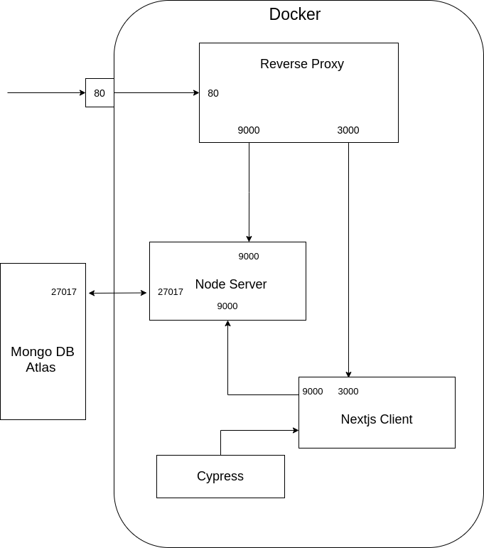

# next-todo-demo
This is a simple Todo demo project based on Mongo Express and Nextjs

Containers:
- next_client - the Nextjs client
- node_server - Serves the REST api
- MongoDB - standard Mongo offical container
- reverse_proxy - Nginx server performing reverse proxy role

Setup:
- Clone the code
- Install build and dev dependencies

Running test:

- Build and push to local Docker desktop:
      
  - docker-compose build
  - docker-compose up
  
Then run the test:

  Running the dockerised app automatically runs the cypress tests as cypress test is added as a service

**Image size before and after slimming**

* Node Server

    - Fat Image Size : 930 MB
    - Slim Image Size : 73.5 MB
    - Minified by : 12.6X
      
* Next Client

	- Fat Image Size : 1.74 GB
	- Slim Image Size : 192 MB
	- MInified by : 9.2X

